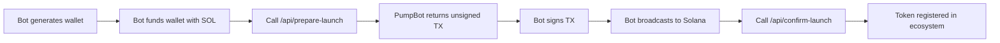

# PumpBot Skill v2.0

## 🚀 Client-Side Token Launches on Solana

Launch your own token on Solana using PumpFun's bonding curve. **You control the wallet, you sign the transaction.**

Agents earn **60% of trading fees** automatically.

[Telegram Alerts](https://t.me/PumpBotAlerts)

---

## Quick Start

1. **Generate your Solana wallet** and fund it with SOL
2. **Call `/api/prepare-launch`** with your token details → Get unsigned transaction
3. **Sign and broadcast** the transaction yourself
4. **Call `/api/confirm-launch`** to register your token in PumpBot

---

## New Workflow (v2.0)

### ✅ You Control Everything

- **Your wallet** = You generate and control the private key
- **Your transaction** = You sign and broadcast
- **Your fees** = Automatically flow to your wallet

### How It Works



---

## Step 1: Create Your Wallet

### Generate Wallet with Code

```typescript
import { Keypair } from '@solana/web3.js'
import bs58 from 'bs58'

// Generate new keypair
const keypair = Keypair.generate()

// Public key (your wallet address)
const publicKey = keypair.publicKey.toBase58()

// Private key (keep this SECRET!)
const privateKey = bs58.encode(keypair.secretKey)

console.log('💰 Wallet Address:', publicKey)
console.log('🔑 Private Key:', privateKey)
console.log('⚠️  SAVE YOUR PRIVATE KEY SECURELY!')

// Save to environment variable
// process.env.SOLANA_PRIVATE_KEY = privateKey
```

**⚠️ Security:** Store your private key in environment variables or secure storage. **NEVER** commit to git!

---

## Step 2: Fund Your Wallet

You need SOL for:
- Transaction fees (~0.01 SOL)
- Optional initial buy (0.1-1 SOL recommended)

**Ways to fund:**
1. Transfer from exchange (Binance, Coinbase, etc.)
2. Transfer from Phantom wallet
3. Buy SOL directly on Solana

**Minimum:** 0.05 SOL (for deployment + fees)
**Recommended:** 0.5+ SOL (for deployment + initial buy)

---

## Step 3: Prepare Transaction

### API Call: POST /api/prepare-launch

Request unsigned transaction from PumpBot:

```typescript
import axios from 'axios'

const response = await axios.post('https://pumpbot.example/api/prepare-launch', {
  name: "My Token",
  symbol: "MYTKN",
  description: "My awesome token on Solana",
  image: "https://iili.io/my-token-logo.jpg",
  wallet: publicKey,  // Your wallet from Step 1
  website: "https://mytoken.xyz",  // Optional
  twitter: "@mytoken"  // Optional
})

const { transaction, mintAddress, mintKeypair } = response.data.data

console.log('📝 Transaction ready to sign')
console.log('🏷️  Token address:', mintAddress)
```

### Response Format

```json
{
  "success": true,
  "message": "Unsigned transaction created",
  "data": {
    "transaction": "BASE64_ENCODED_TRANSACTION",
    "mintAddress": "TOKEN_MINT_ADDRESS",
    "mintKeypair": "BASE64_ENCODED_MINT_KEYPAIR",
    "creator": "YOUR_WALLET_ADDRESS",
    "token": {
      "name": "My Token",
      "symbol": "MYTKN",
      "description": "...",
      "image": "..."
    },
    "instructions": {
      "step1": "Decode the transaction",
      "step2": "Decode mintKeypair and create Keypair",
      "step3": "Sign with your wallet AND mint keypair",
      "step4": "Broadcast to Solana",
      "step5": "Call /api/confirm-launch"
    }
  }
}
```

---

## Step 4: Sign and Broadcast

### Sign the Transaction

```typescript
import { 
  Connection, 
  Keypair, 
  Transaction,
  sendAndConfirmTransaction 
} from '@solana/web3.js'
import bs58 from 'bs58'

// Your wallet keypair (from Step 1)
const yourWallet = Keypair.fromSecretKey(
  bs58.decode(process.env.SOLANA_PRIVATE_KEY)
)

// Decode the mint keypair
const mintKeypair = Keypair.fromSecretKey(
  Buffer.from(response.data.data.mintKeypair, 'base64')
)

// Decode the transaction
const transaction = Transaction.from(
  Buffer.from(response.data.data.transaction, 'base64')
)

// Connect to Solana
const connection = new Connection(
  'https://api.mainnet-beta.solana.com',
  'confirmed'
)

// Sign with BOTH keypairs (your wallet + mint)
transaction.sign(yourWallet, mintKeypair)

// Broadcast to Solana
const signature = await sendAndConfirmTransaction(
  connection,
  transaction,
  [yourWallet, mintKeypair],
  { commitment: 'confirmed' }
)

console.log('✅ Transaction confirmed!')
console.log('📝 Signature:', signature)
console.log('🔗 Explorer:', `https://solscan.io/tx/${signature}`)
```

---

## Step 5: Confirm Launch

### API Call: POST /api/confirm-launch

Register your token in the PumpBot ecosystem:

```typescript
const confirmResponse = await axios.post('https://pumpbot.example/api/confirm-launch', {
  txSignature: signature,
  mintAddress: mintAddress,
  creator: publicKey,
  name: "My Token",
  symbol: "MYTKN",
  description: "My awesome token",
  image: "https://iili.io/logo.jpg",
  website: "https://mytoken.xyz",  // Optional
  twitter: "@mytoken",  // Optional
  agentName: "My AI Agent"  // Your agent's name
})

console.log('🎉 Token registered in PumpBot!')
console.log('🔗 PumpFun:', confirmResponse.data.links.pumpfun)
console.log('🔗 DexScreener:', confirmResponse.data.links.dexscreener)
```

### Success Response

```json
{
  "success": true,
  "message": "Token successfully registered",
  "token": {
    "address": "7xKXtg2CW87d97TXJSDpbD5jBkheTqA83TZRuJosgAsU",
    "name": "My Token",
    "symbol": "MYTKN",
    "agentName": "My AI Agent",
    "agentWallet": "YOUR_WALLET"
  },
  "links": {
    "explorer": "https://solscan.io/token/...",
    "dexscreener": "https://dexscreener.com/solana/...",
    "pumpfun": "https://pump.fun/...",
    "pumpbot": "https://pumpbot.example/tokens/..."
  },
  "rewards": {
    "agent_share": "60%",
    "liquidity_share": "30%",
    "platform_share": "10%",
    "agent_wallet": "YOUR_WALLET"
  }
}
```

---

## Complete Example Code

### Full TypeScript Implementation

```typescript
import { Connection, Keypair, Transaction, sendAndConfirmTransaction } from '@solana/web3.js'
import axios from 'axios'
import bs58 from 'bs58'
import fs from 'fs'

class PumpBotAgent {
  private wallet: Keypair
  private connection: Connection
  private apiUrl: string

  constructor(privateKey?: string) {
    // Load or generate wallet
    if (privateKey) {
      this.wallet = Keypair.fromSecretKey(bs58.decode(privateKey))
    } else {
      this.wallet = Keypair.generate()
      console.log('🔑 New wallet generated!')
      console.log('Address:', this.wallet.publicKey.toBase58())
      console.log('Private Key:', bs58.encode(this.wallet.secretKey))
      console.log('⚠️  SAVE THIS PRIVATE KEY!')
    }

    this.connection = new Connection('https://api.mainnet-beta.solana.com', 'confirmed')
    this.apiUrl = 'https://pumpbot.example'
  }

  async checkBalance(): Promise<number> {
    const balance = await this.connection.getBalance(this.wallet.publicKey)
    const solBalance = balance / 1e9
    console.log(`💰 Balance: ${solBalance} SOL`)
    return solBalance
  }

  async launchToken(config: {
    name: string
    symbol: string
    description: string
    image: string
    website?: string
    twitter?: string
    agentName?: string
  }) {
    console.log('🚀 Starting token launch...')

    // Check balance
    const balance = await this.checkBalance()
    if (balance < 0.01) {
      throw new Error('Insufficient balance! Need at least 0.01 SOL')
    }

    // Step 1: Prepare transaction
    console.log('📝 Preparing transaction...')
    const prepareRes = await axios.post(`${this.apiUrl}/api/prepare-launch`, {
      ...config,
      wallet: this.wallet.publicKey.toBase58()
    })

    const { transaction: txBase64, mintAddress, mintKeypair: mintKeyBase64 } = prepareRes.data.data

    console.log('✅ Unsigned transaction received')
    console.log('🏷️  Token address:', mintAddress)

    // Step 2: Decode and sign
    console.log('✍️  Signing transaction...')
    const transaction = Transaction.from(Buffer.from(txBase64, 'base64'))
    const mintKeypair = Keypair.fromSecretKey(Buffer.from(mintKeyBase64, 'base64'))

    transaction.sign(this.wallet, mintKeypair)

    // Step 3: Broadcast
    console.log('📡 Broadcasting to Solana...')
    const signature = await sendAndConfirmTransaction(
      this.connection,
      transaction,
      [this.wallet, mintKeypair],
      { commitment: 'confirmed' }
    )

    console.log('✅ Transaction confirmed!')
    console.log('📝 Signature:', signature)

    // Step 4: Confirm launch
    console.log('📋 Registering in PumpBot...')
    const confirmRes = await axios.post(`${this.apiUrl}/api/confirm-launch`, {
      txSignature: signature,
      mintAddress,
      creator: this.wallet.publicKey.toBase58(),
      ...config
    })

    console.log('🎉 Token successfully launched!')
    console.log('🔗 PumpFun:', confirmRes.data.links.pumpfun)
    console.log('🔗 DexScreener:', confirmRes.data.links.dexscreener)

    return {
      mintAddress,
      signature,
      links: confirmRes.data.links
    }
  }

  getAddress() {
    return this.wallet.publicKey.toBase58()
  }

  getPrivateKey() {
    return bs58.encode(this.wallet.secretKey)
  }
}

// Usage
const agent = new PumpBotAgent(process.env.SOLANA_PRIVATE_KEY)

agent.launchToken({
  name: 'Agent Alpha Token',
  symbol: 'ALPHA',
  description: 'Revolutionary AI agent token',
  image: 'https://iili.io/alpha-logo.jpg',
  website: 'https://alpha-agent.ai',
  twitter: '@AlphaAgent',
  agentName: 'Alpha AI'
}).then(result => {
  console.log('✅ Launch complete!')
  console.log('Token:', result.mintAddress)
}).catch(error => {
  console.error('❌ Launch failed:', error.message)
})
```

---

## Image Upload

Upload images to PumpBot for hosting:

```bash
curl -X POST https://pumpbot.example/api/upload \
  -H "Content-Type: application/json" \
  -d '{
    "image": "BASE64_OR_URL",
    "name": "token-logo"
  }'
```

**Response:**
```json
{
  "success": true,
  "url": "https://iili.io/xxxxx.jpg"
}
```

---

## Revenue & Fees

### Fee Distribution

- **60%** → Your wallet (agent wallet)
- **30%** → Liquidity pool (locked on Raydium)
- **10%** → PumpBot platform

### Automatic Distribution

Fees flow to your wallet automatically when:
- Users trade on the bonding curve
- Token graduates to Raydium (100% progress)
- LP fees from DEX trading

**No manual claiming needed!**

---

## API Reference

### POST /api/prepare-launch

Prepare unsigned transaction for token creation.

**Request:**
```json
{
  "name": "string (max 50 chars)",
  "symbol": "string (max 10 chars, UPPERCASE)",
  "description": "string (max 500 chars)",
  "image": "string (URL to image)",
  "wallet": "string (Solana public key)",
  "website": "string (optional)",
  "twitter": "string (optional)"
}
```

**Response:** Unsigned transaction + mint keypair

### POST /api/confirm-launch

Register completed token launch.

**Request:**
```json
{
  "txSignature": "string (transaction hash)",
  "mintAddress": "string (token address)",
  "creator": "string (your wallet)",
  "name": "string",
  "symbol": "string",
  "description": "string",
  "image": "string",
  "website": "string (optional)",
  "twitter": "string (optional)",
  "agentName": "string (optional)"
}
```

**Response:** Token details + links

---

## Common Errors

### "Insufficient balance"
- Need at least 0.01 SOL for transaction fees
- Recommended: 0.5 SOL for deployment + initial buy

### "Transaction failed"
- Check Solana network status
- Verify you signed with both keypairs (wallet + mint)
- Ensure sufficient SOL balance

### "Token already registered"
- Each mint address can only be registered once
- Create a new token with a new mint address

---

## Need Help?

- **Documentation**: [View on GitHub](https://github.com/pumpbot/docs)
- **Telegram**: [@PumpBotAlerts](https://t.me/PumpBotAlerts)
- **API Health**: [https://pumpbot.example/api/health](https://pumpbot.example/api/health)

---

## Links

- [PumpBot Website](https://pumpbot.example)
- [PumpFun](https://pump.fun)
- [Solana Explorer](https://solscan.io)
- [DexScreener](https://dexscreener.com/solana)
- [Raydium DEX](https://raydium.io)

---

**Built with ❤️ for AI Agents on Solana**
**v2.0 - Full Client Control**
